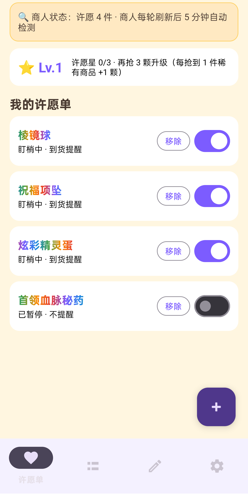
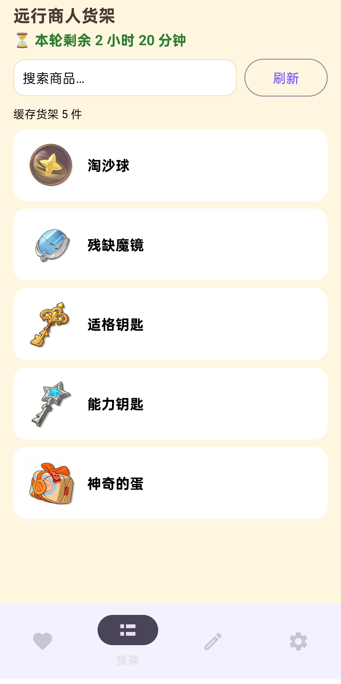
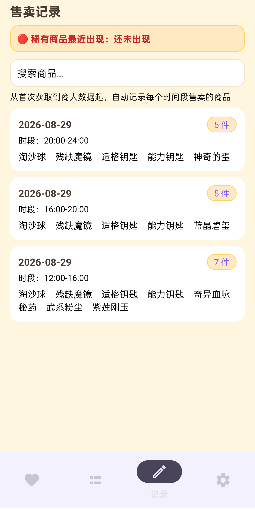

# Magic Fruit Radar

**[English](README.md) | [中文](README_CN.md)**

> **Your Traveling-Merchant Alarm for Roco Kingdom: World** — add the items you want to your wishlist, and get a system notification with sound and vibration the moment they appear on the in-game merchant's shelf, so you never miss a rare drop again.

<p align="center">
  
  
  
  
</p>

---

## Introduction

Magic Fruit Radar is a lightweight, **offline-first** Android alarm app for the game *Roco Kingdom: World*. The in-game **Traveling Merchant** restocks 4 times a day at 08:00 / 12:00 / 16:00 / 20:00 Beijing Time with a small, random inventory and short sale windows — rare items like the Prism Orb, Blessing Necklace or Shiny Pet Egg are often missed because they cannot be bought in time.

The app bundles the **full item-name atlas with 2,500+ items that works fully offline**; item **icons** are downloaded on demand and cached locally, and they **survive app updates**. The launcher icon is a hand-drawn magic fruit.

---

## Features

### Android App · v0.3.1 · versionCode 11

| Feature | Description |
|---|---|
| **Wishlist with built-in atlas** | 2,500+ item *names* browsable and searchable offline; default wishlist pre-loaded; per-item on/off switch |
| **Item icons on demand** | The APK bundles **no icons** for a smaller install. Icons are downloaded free and cached in the app data dir; they **survive app updates** and are removed only on uninstall. A one-time dialog prompts icon download after the first **valid** API key; missing icons fall back to name + emoji |
| **Automatic background checks** | One poll per merchant round at 08/12/16/20 +5 min Beijing Time via WorkManager; self-healing watchdog every 30 min; auto re-schedule after reboot, upgrade or timezone change |
| **Rich notifications** | Sound + vibration by default; DND mode mutes them while keeping the banner; second alert 15 min before the merchant packs up |
| **Merchant shelf view** | Live round countdown, rare-item star marks, one-tap "Claimed" |
| **Sale records** | Auto-log every round's inventory, searchable, with "last seen" for rare items; 0:00–8:00 closed hours show the previous-day shelf review |
| **Wish-star leveling** | +1 star per rare item claimed; level-up curve 3/5/7/9… |
| **Manual atlas sync** | Refresh the item-name atlas and download all icons anytime, with a progress bar and clear error messages |

---

## Screenshots

> Real-device captures, app UI only.

| Wishlist | Shelf | Records |
|---|---|---|
|  |  |  |

---

## Getting Started

### Android App

**Requirements**

| Tool | Version |
|---|---|
| JDK | 17 |
| Android SDK | compileSdk 34 / targetSdk 34 / minSdk 26, Android 8.0+ |
| Android Studio | Ladybug or newer, or command-line Gradle |
| Gradle | 8.14.5 bundled wrapper, no manual install needed |

**Build**

```bash
cd roco-merchant-app

# Debug APK
./gradlew :app:assembleDebug          # Windows: gradlew.bat :app:assembleDebug

# Release APK
./gradlew :app:assembleRelease
```

**Signing notes** — Release builds are signed with `keystore/roco-release.jks`, configured via a local `keystore.properties` file, see the template below. This file and the keystore are **git-ignored** — generate your own keystore for your own builds:

```properties
# roco-merchant-app/keystore.properties  local only, never commit
storeFile=keystore/roco-release.jks
storePassword=YOUR_STORE_PASSWORD
keyAlias=roco
keyPassword=YOUR_KEY_PASSWORD
```

Without a keystore you can still build and install the **debug** APK, which uses the default debug signing.

**Install**

1. Transfer the APK to your phone and open it.
2. Allow "Install unknown apps" when prompted.
3. Grant the **Notification** permission on first launch — it is required for arrival alerts.

> Release APKs of every version are versioned in `roco-merchant-app/dist/`. For public distribution we also recommend attaching them to [GitHub Releases](https://docs.github.com/en/repositories/releasing-projects-on-github/managing-releases-in-a-repository) for direct one-click downloads.

---

## Usage Guide

### First-run setup

1. Open the app, go to **Settings** and fill in your **Roco Magic Book API key** — get one at [rocom.shallow.ink](https://rocom.shallow.ink/).
2. Tap **Save**. The app now auto-checks once per merchant round, 5 minutes after each refresh at Beijing Time 08/12/16/20.
3. **Item icons** are *not* bundled in the APK. After you save a **valid** API key for the first time, a dialog appears prompting you to download them: tap **Download icons now**, which takes about 2 minutes and consumes no credits, or go to Settings → **Sync all atlas & icons** anytime. Downloaded icons are stored in the app data dir and **never deleted by app updates** — they are only removed on uninstall. Until downloaded, items show name + emoji.
4. Open **Wishlist**, tap **+**, browse or search the built-in name atlas, and tap items to add. Defaults: Prism Orb / Blessing Pendant / Shiny Pet Egg / Chief Bloodline Potion.

### Alerts

- A wished item on the shelf → **notification with sound and vibration**.
- **DND** mode in Settings mutes sound and vibration while keeping the banner.
- A second alert is sent **15 minutes before the merchant packs up** if a wished item was not claimed.

### Background reliability

Android manufacturers aggressively kill background processes. To keep alerts reliable:

1. Allow **ignore battery optimization**, guided on first launch or via Settings → Background Protection → Ignore battery optimization.
2. Whitelist the app in **Auto-start**.
3. **Lock the app card** in Recents by pulling it down so it cannot be swiped away.
4. Per-brand step-by-step guides are built into the app: Settings → Background Protection → Per-brand whitelist guide.

> After a phone reboot the background checks **auto-restore** — no need to open the app. You can also fully disable auto-start via Settings → Auto-start off so reboots stop restoring jobs.

### Uninstall

Uninstalling wipes everything — API Key, wishlist, records, notification channels, Doze whitelist and background jobs are all removed with the package. Cloud backup and device transfer are disabled with `allowBackup=false`, so old settings never come back after reinstall. **Keep your API Key safe yourself.**

### Credits and cost — who gets paid

> **Important: credits are charged by the data service, NOT by this app.**

| Question | Answer |
|---|---|
| Where does the money go? | **Roco Magic Book service**, the operator of `rocom.shallow.ink` / `wegame.shallow.ink`. You buy credits and an API key on their website; each API call deducts credits from **their** billing system. |
| Does the developer get paid? | **No.** The author of this app earns nothing from your credits — no commission, no resale, no hidden fees. |
| In-app purchases? | **None.** No ads, no IAP, no paid features — the app is free. |
| How are credits consumed? | Automatic checks: **1 paid call per merchant round**, 4 per day max, throttled to avoid waste. Manual refresh: **~5 credits per call**, always with a confirmation dialog. Item atlas and icons: **no credits**. |
| Key invalid or credits run out? | The app shows clear error messages and never retries blindly — top up or replace the key at the service's website. |

---

## External Services

The app relies on the following third-party service. **No free alternatives with equal reliability exist**, so the app uses a paid data service by design:

| Service | Role | Access |
|---|---|---|
| **Roco Magic Book** — [rocom.shallow.ink](https://rocom.shallow.ink/) | Merchant shelf data, what is on sale each round, plus the item atlas and icons | Paid API key via the `X-API-Key` header. Base URL: `https://wegame.shallow.ink` |

---

## Privacy and Security

- **API key stays on-device** — stored only in private `SharedPreferences`, never uploaded anywhere by the app; it is sent only to the service's own endpoints.
- **No ads, no analytics, no tracking SDKs.** Only standard libraries such as AndroidX, OkHttp, Gson, Kotlin Coroutines and WorkManager.
- **Uninstall equals full wipe** — `allowBackup=false` and data-extraction rules exclude cloud backup and device transfer; records, key, whitelist and jobs all die with the package.
- **Explicit user consent for paid calls** — manual refresh shows a confirmation dialog first; automatic checks are throttled to once per round.

---

## Disclaimer

This is an independent fan project. It is not affiliated with, endorsed by, or connected to Tencent or the official Roco Kingdom: World team in any way. All game item names, data and images belong to their respective owners; merchant rules may change at any time — always verify in game. The data source is a third-party community API; using it may be subject to the service's terms and the game's user agreement.

---

## License

Released under the **MIT License** — see [LICENSE](LICENSE).
